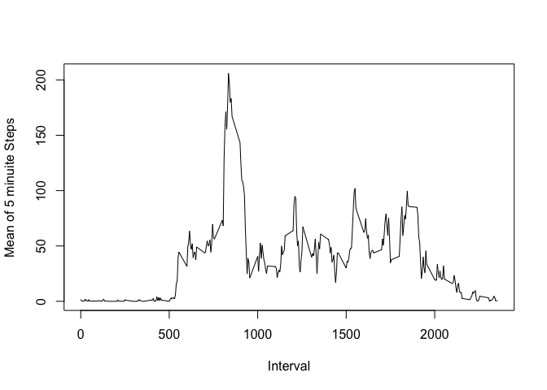
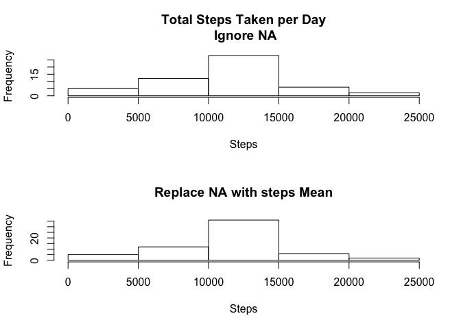
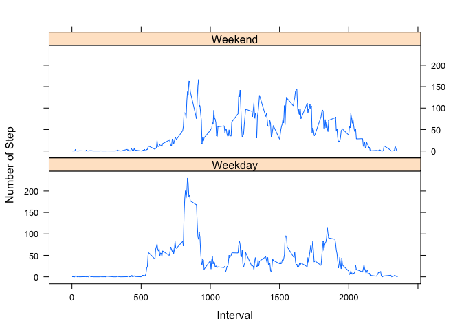

# Reproducible Research: Peer Assessment 1
zon1002  


## Loading and preprocessing the data
* Unzip __activity.zip__
* Read it to the data frame __activity__


```r
dataname <- unzip("activity.zip")
activity <- read.csv(dataname)
```


## What is mean total number of steps taken per day?
1. Calculate the total number of steps taken per day


```r
totalsteps<-aggregate(steps ~ date, activity, sum, na.rm = TRUE)
```

2. Make a histogram of the total number of steps taken each day


```r
hist(totalsteps$steps, xlab = "Total Steps per Day", main = "Histogram of Total Steps per Day")
```

 

3. Calculate and report the mean and median of the total number of steps taken per day


```r
mean(totalsteps$steps)
```

```
## [1] 10766.19
```

```r
median(totalsteps$steps)
```

```
## [1] 10765
```

## What is the average daily activity pattern?

1. Make a time series plot of the 5-minute interval (x-axis) and the average number of steps taken, averaged across all days (y-axis)

```r
intervalsteps <- aggregate(steps ~ interval, activity, mean, na.rm = TRUE)
plot(steps ~ interval, intervalsteps, type="l",
    xlab = "Interval", ylab = "Mean of 5 minuite Steps")
```

 

2. Which 5-minute interval, on average across all the days in the dataset, contains the maximum number of steps?

```r
intervalsteps[which.max(intervalsteps$steps),]$interval
```

```
## [1] 835
```

## Imputing missing values
1. Calculate and report the total number of missing values in the dataset (i.e. the total number of rows with NA s)

```r
sum(is.na(activity$steps))
```

```
## [1] 2304
```

2. Devise a strategy for filling in all of the missing values in the dataset. 
    * Make a copy of activity data frame called __noNAact__
    * Search NA in __noNAact__ using for loop
    * Replace NA with the mean of interval steps from previous data frame __intervalsteps__

3. Create a new dataset that is equal to the original dataset but with the missing data filled in.

```r
noNAact <- activity
for (i in which(is.na(noNAact$steps) == TRUE)){
    noNAact[i,1] <- intervalsteps[which(intervalsteps$interval == noNAact[i,3]), 2]
}
```

4. Make a histogram of the total number of steps taken each day and Calculate and report the mean and median total number of steps taken per day. 
    

```r
NoNAintervalsteps <- aggregate(steps ~ date, noNAact, sum)
par(mfrow=c(2,1))
hist(totalsteps$steps, xlab = "Steps", 
    main = "Total Steps Taken per Day\n Ignore NA")

hist(NoNAintervalsteps$steps, xlab = "Steps", 
    main = "Replace NA with steps Mean")
```

 

```r
mean(NoNAintervalsteps$steps)
```

```
## [1] 10766.19
```

```r
median(NoNAintervalsteps$steps)
```

```
## [1] 10766.19
```

* Do these values differ from the estimates from the first part of the assignment? 

Mean value stay the same, but the median value changed to ___10766.19___

* What is the impact of imputing missing data on the estimates of the total daily number of steps?

After replaced NA values with the mean value, the toal steps per day increased.
The days frequency increased after replacing NA value with the mean value of the interval. Days in 10000 ~ 15000 per day has significant increase from arround 27 days to 35 days. All the other steps per day range does not change much on the graph.


## Are there differences in activity patterns between weekdays and weekends?

```r
library(lattice)
noNAact$weekday <- as.factor(ifelse(weekdays(as.Date(noNAact$date)) 
    %in% c("Saturday","Sunday"), "Weekend", "Weekday"))

noNAactStepMean <- aggregate(steps ~ interval+weekday, noNAact, mean, na.rm = TRUE)
xyplot(steps ~ interval|weekday, data=noNAactStepMean, layout=c(1,2), 
    type = "l", ylab = "Number of Step", xlab = "Interval")
```

 
